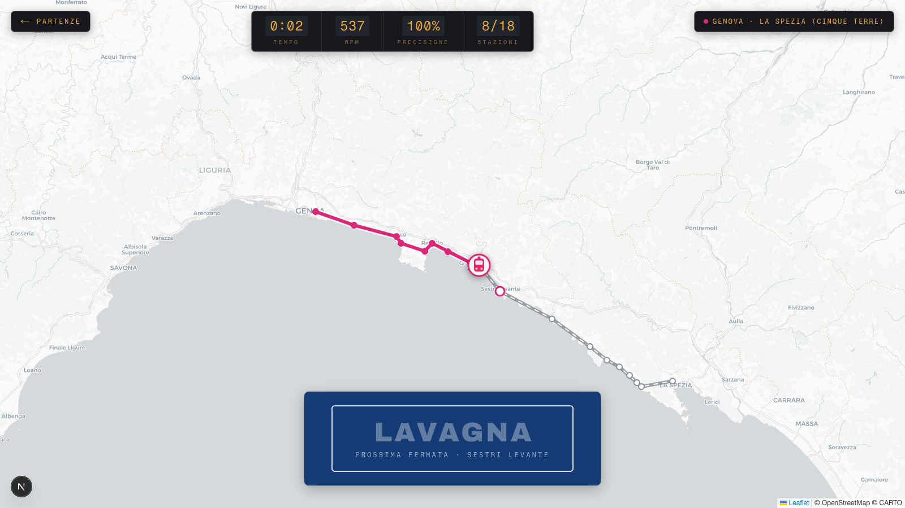
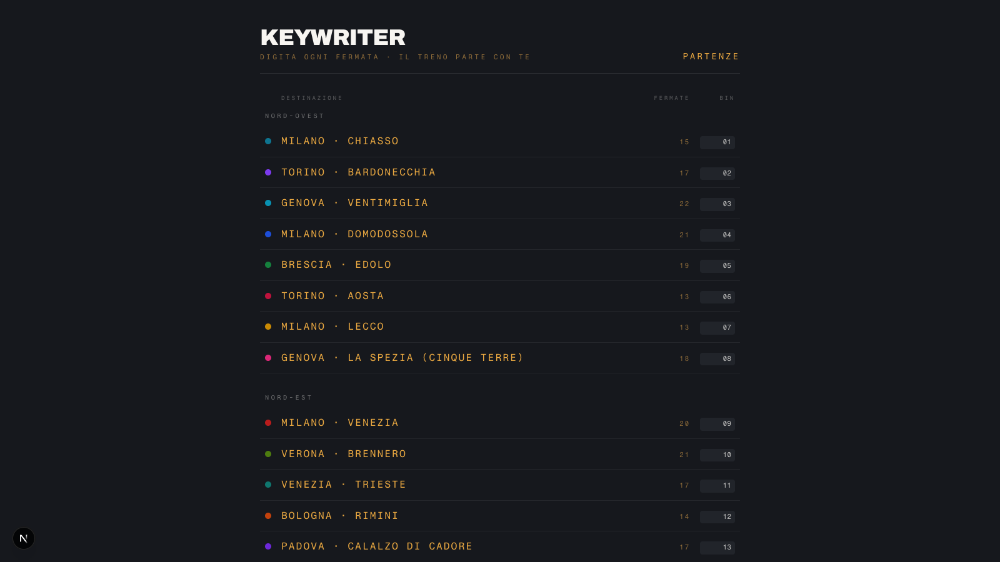
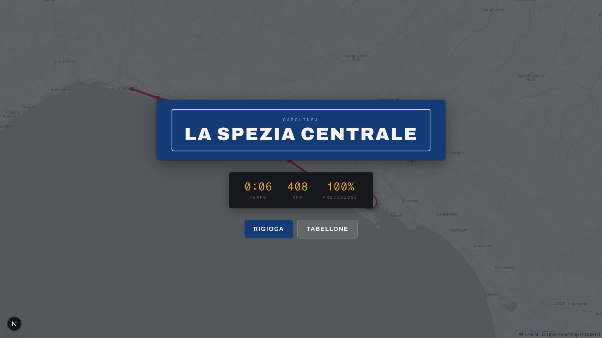

<h1 align="center">Keywriter 🚂</h1>

<p align="center"><em>A typing game that runs on the Italian railway network — type each stop, and the train moves down the line.</em></p>

<p align="center">
  
  
  
  
  
</p>

<p align="center"><strong><a href="https://keywriter-phi.vercel.app">▶ Play it live</a></strong></p>



Inspired by the "station by station" typing videos of Japanese rail lines — rebuilt on Italian
railways. Pick one of 30 real regional lines, and the name of the next stop appears on a blue
enamel station sign. Every correct character nudges the train forward along the track on a
full-screen map; every mistake flashes the sign red. Reach the terminus and a split-flap board
reports your time, WPM and accuracy. No backend, no accounts, no onboarding: choose a line and
start typing.

## Features

- **30 real lines, 454 stations** — from the Cinque Terre to the Circumvesuviana, the Faentina to the Calabrian Tyrrhenian coast, grouped into four regions (Nord-Ovest, Nord-Est, Centro, Sud e Isole).
- **Character-level train motion** — the locomotive's position is a fractional station index (e.g. `3.4` = 40 % between stops 4 and 5), driven by the correct prefix of what you have typed.
- **Forgiving input matching** — names are normalised before comparison: diacritics stripped, lower-cased, punctuation collapsed to spaces, so `sant'ambrogio` and `sant ambrogio` both count.
- **Live error feedback** — the sign flashes FS red, letters still to be deleted stay underlined in red, and a blinking caret shows exactly where you are.
- **Split-flap scoreboard** — elapsed time, WPM (correct characters ÷ 5 per minute) and accuracy (correct characters ÷ total keystrokes) update as you type, each cell flipping on change.
- **Hand-rolled animation** — the train chases its target with exponential deceleration on `requestAnimationFrame`; the map pans only when it leaves the centre frame. No animation library.
- **Retro FS signage design** — departures board, enamel signs, mono board typography, an OKLCH palette, and `prefers-reduced-motion` support.
- **Purely static** — no API routes, no database, no environment setup; the whole game is the line dataset plus a reducer.

### Departures board

The 30 lines in Solari-board style, with platform number and stop count.



### Terminus



## Tech stack

| Layer | Choice |
| --- | --- |
| Framework | Next.js 16.2.10 (App Router) |
| UI | React 19.2.4, TypeScript 5 |
| Styling | Tailwind CSS v4 via `@tailwindcss/postcss`, custom OKLCH theme tokens |
| Fonts | Archivo + Fragment Mono, loaded through `next/font/google` |
| Map | Leaflet 1.9 with CARTO Positron tiles on OpenStreetMap data |
| Tooling | ESLint 9 (`eslint-config-next`), `puppeteer-core` for README screenshots |

## Getting started

Prerequisites: Node.js and npm (the repo targets Next.js 16 / React 19).

```bash
npm install
npm run dev      # http://localhost:3000
```

| Script | What it does |
| --- | --- |
| `npm run dev` | Start the development server |
| `npm run build` | Production build |
| `npm run start` | Serve the production build |
| `npm run lint` | Run ESLint |

## Configuration

The game itself needs no configuration — there are no API keys, no services and no `.env` file.
The only environment variable in the codebase belongs to the screenshot script:

| Variable | Required | What it does |
| --- | --- | --- |
| `BASE_URL` | No | Base URL that `scripts/screenshots.mjs` drives with Puppeteer. Defaults to `http://localhost:3000`. |

## How it works

- **State** lives in a single `useReducer` in `lib/useTypingGame.ts`. Every keystroke dispatches an `input` action that scores the newly added characters, advances the station index on a match, and stops the clock at the terminus.
- **Position** is derived, not stored: `trainPos = stationIndex + (correct prefix ÷ target length)`, a float the map interpolates along the polyline of station coordinates.
- **The map** (`components/RailMap.tsx`) is imperative Leaflet mounted with `next/dynamic` and `ssr: false`, since Leaflet needs `window`. A `requestAnimationFrame` loop eases the marker toward the target with `1 - exp(-7 · dt)`, repaints the covered track, and lights up stations as they are passed.
- **The dataset drives everything.** Menu, map and game are all generated from `lib/lines/` — adding a line requires no other change.

### Adding a line

Lines live in `lib/lines/`, one file per region. Append an object to the exported array:

```ts
{
  id: "bologna-porretta",
  label: "Bologna → Porretta Terme",
  region: "Nord-Est",
  color: "#92400e",            // track colour on the map
  stations: [
    { name: "Bologna Centrale", lat: 44.5057, lng: 11.3428 },
    // ...in travel order
  ],
}
```

> Station coordinates are approximate (±1–2 km): good enough for the game, not for cartography.

### Regenerating the README screenshots

```bash
npm run dev &
node scripts/screenshots.mjs   # uses the system Chrome, writes into docs/
```

## Project structure

```
app/          # App Router entry: layout, global styles, single page
components/   # Game shell, LineMenu, RailMap, StationCard, Scoreboard, ResultScreen
lib/
  lines/      # The dataset: one file per region + shared types
  useTypingGame.ts   # Reducer, normalisation, stats, train position
scripts/      # Puppeteer script that regenerates docs/*.png
docs/         # README screenshots
```

## License

No license file is declared in this repository yet.
